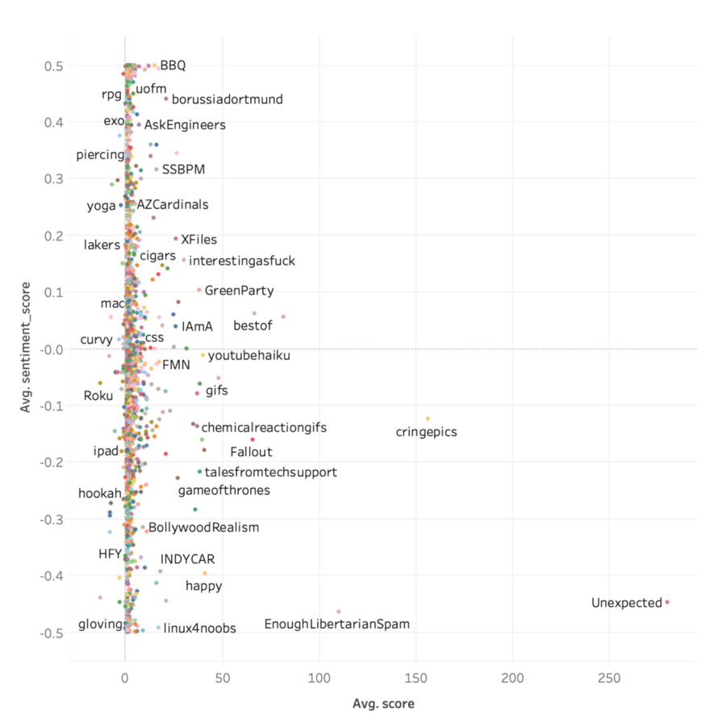
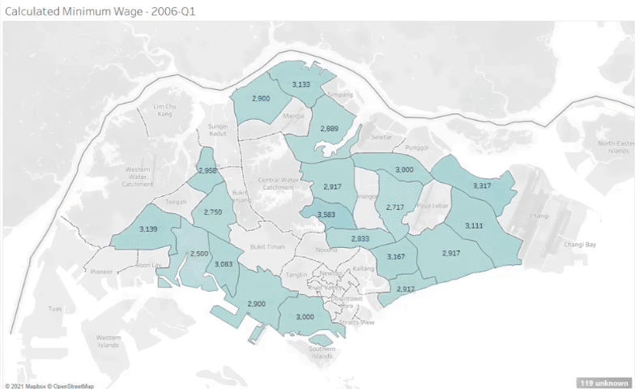
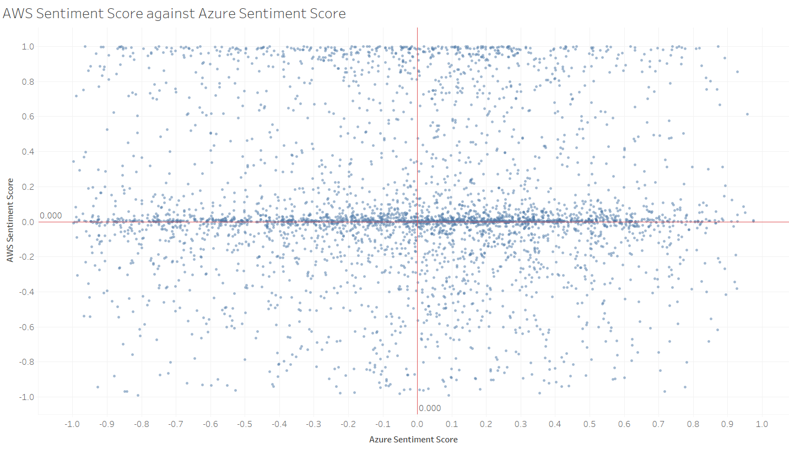
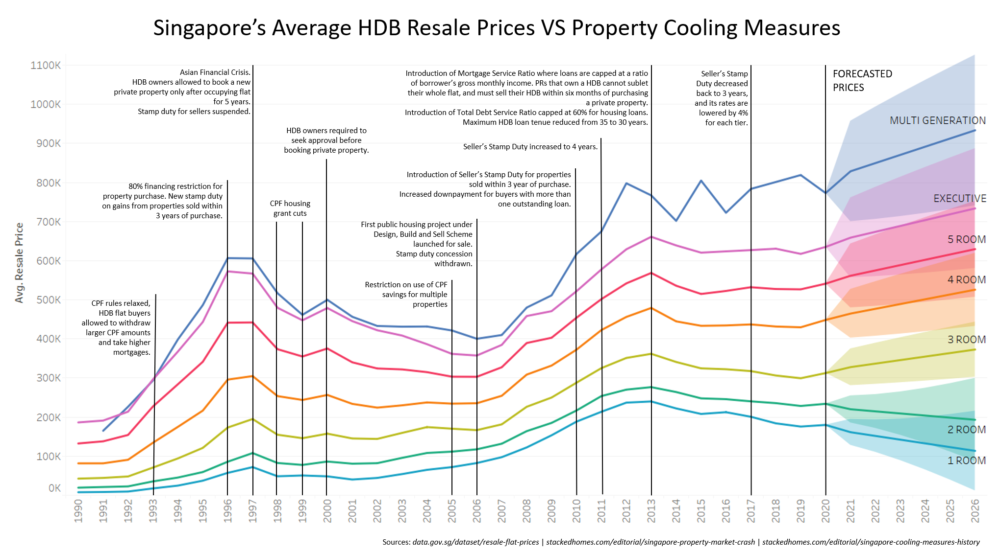
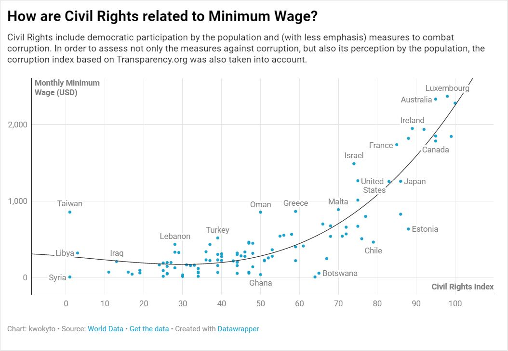
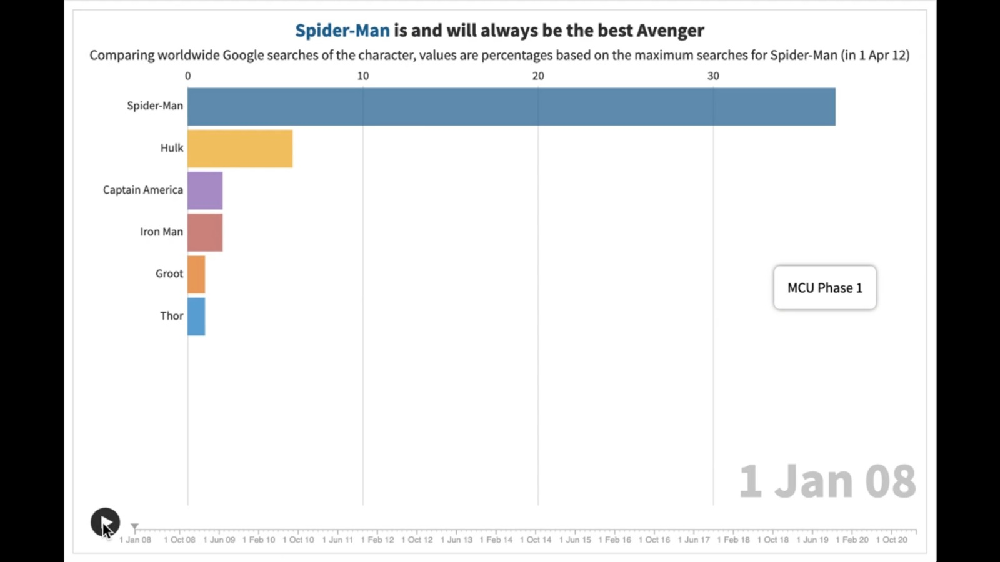
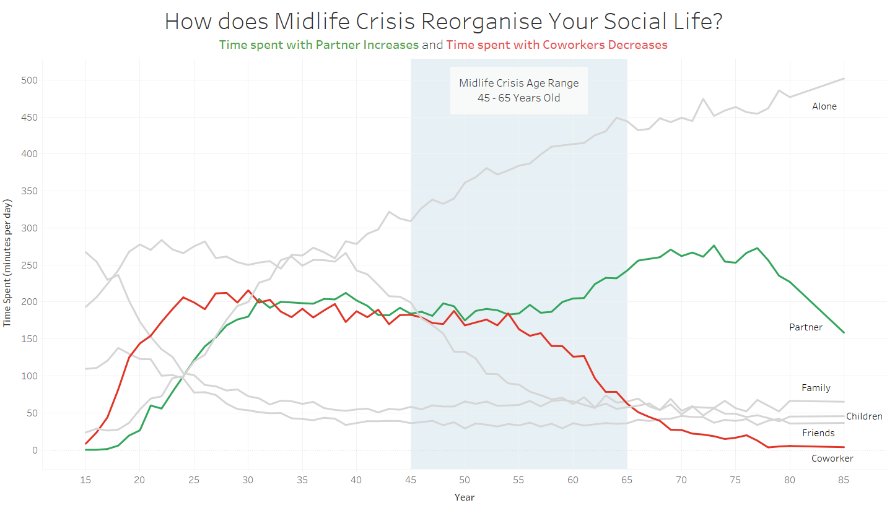
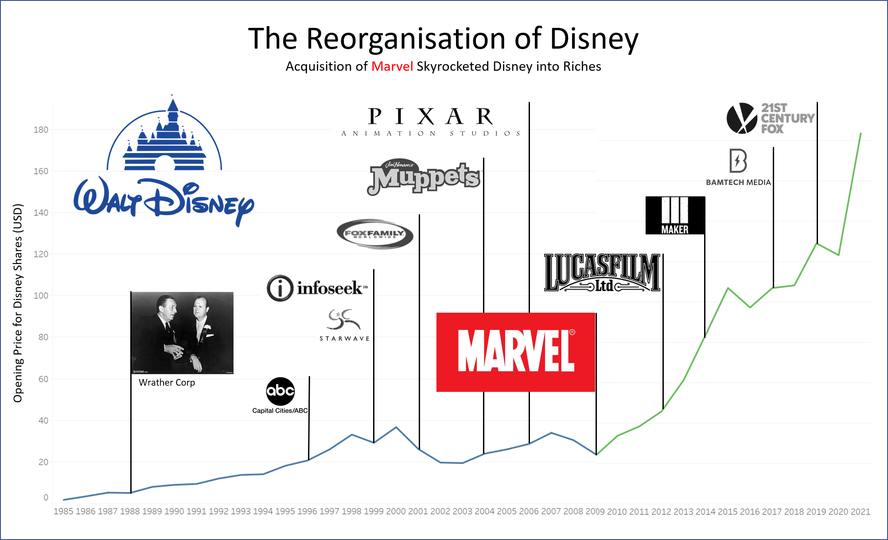
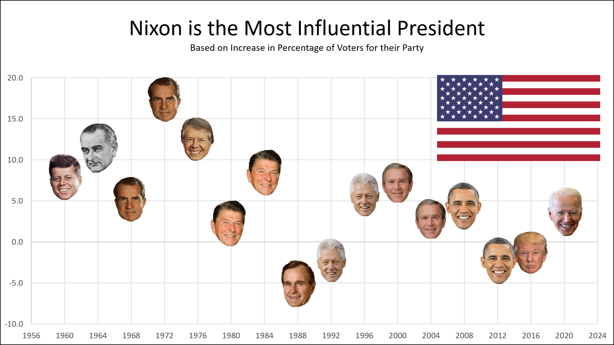

# DMI Consolidation

[Developing Meaningful Indicators](https://www.usp.nus.edu.sg/curriculum/usp-modules/developing-meaningful-indicators/) (DMI) was a module in USP taught be Dr. Charles Burke.
DMI allowed us understand, use, and visualise data in a way that prioritises creating an effect on others.
This is in-line with the [USP](https://www.usp.nus.edu.sg/about/overview/)'s purpose to shape independent, adaptable thinkers and doers who will make an impact in the world.

This page serves as a consolidation of the notable work that I have produced, as well as a reflection of my takeaways from this module. In all, this would also be an indicator of my progress in the semester.

## Contents

* [Sentiment Analysis](#sentiment-analysis)
* [30% Rule](#30%-rule)
* [Comparing Machine Learning](#comparing-machine-learning)
* [Property Cooling Measures](#property-cooling-measures)
* [Singapore's Minimum Wage](#singapore's-minimum-wage)
* [Avengers](#avengers)
* [Reorganisation](#reorganisation)
* [Reflection](#reflection)
* [Summary of Impact](#summary-of-impact)
* [Other Visualisations](#other-visualisations)

## Sentiment Analysis

Inspired by a comment about Natural Language Processing (NLP) by Dr. Charles, my friend Ling Hui and I attempted to try it out for ourselves.
We initially hypothesised that people on Reddit would generally give comments with positive sentiment as after all, Reddit is a community platform where people would share their ideas and stories with one another.
We also thought that there would be some positive correlation between sentiment score and score.

Among all the graphs we then produced, this was a scatter plot of average sentiment score against average score in upvotes.

We co-documented details of the entire process in a Medium article.
The article was subsequently published onto Towards Data Science and is titled "[Trying to use a 30GB database for sentiment analysis](https://towardsdatascience.com/trying-to-use-a-30gb-database-for-sentiment-analysis-137d5f5c5fc5)". More graphs created can also be found in the article as well.

## 30% Rule

This visualisation was inspired by a Reddit post which used the 30% rule to predict minimum wages in the US.
The 30% rule states that one should spend no more than 30% of their salary on rental.
Naturally, used this idea and produced a graph for Singapore using median rental rates in different neighbourhoods.

I shared this visualisation onto Reddit. Below are the links to the posts on the different subreddits. My friend Ling Hui had helped me crosspost into r/singapore since I did not have enough karma at that time to post in it.

* [r/dataisbeautiful](https://www.reddit.com/r/dataisbeautiful/comments/lbfl42/oc_inspired_to_create_minimum_wage_for_singapore/)
* [r/singapore](https://www.reddit.com/r/singapore/comments/lbfqgd/oc_inspired_to_create_minimum_wage_for_singapore/)

## Comparing Machine Learning

My classmate Nicole used Azure Machine Learning on Excel to conduct sentiment analysis on over 4000 Pfizer-related tweets in order to determine how most people felt about the vaccine.
Based on my previous visualisation using AWS Comprehend this actually got me asking, “Which of the AI models is more accurate?”

I then compared the scores resulting from both algorithms to produce the graph below.

This whole process was written into a Medium article that is titled "[Comparing AWS Comprehend and Azure ML on Excel](https://kwokyto.medium.com/comparing-aws-comprehend-and-azure-ml-on-excel-44b0f224294c)".
Additionally, I also shared another visualisation to Reddit.

* [r/dataisbeautiful](https://www.reddit.com/r/dataisbeautiful/comments/layqf2/oc_difference_between_azure_and_aws_ml_on_same/)
* [r/SentimentAnalysis](https://www.reddit.com/r/SentimentAnalysis/comments/lbqwk1/oc_difference_between_azure_and_aws_ml_on_same/)

## Property Cooling Measures

This next visualisation came about because I was discussing BTO-ing with my girlfriend and I was wondering about BTO prices in singapore.
As we discussed, the idea of buying a resale flat came up as a viable option.
I then came across this article that talked about how more property cooling measures were to be expected in the coming months.

I plotted the resale prices of HDBs over the years, as well as the various property cooling measures.

This was also shared onto Reddit on several subreddits.

* [r/dataisbeautiful](https://www.reddit.com/r/dataisbeautiful/comments/lxk9f2/oc_how_effective_are_singapores_property_cooling/)
* [r/singapore](https://www.reddit.com/r/singapore/comments/m0zujk/oc_how_effective_are_singapores_property_cooling/)
* [r/SingaporeRaw](https://www.reddit.com/r/SingaporeRaw/comments/lxk67v/how_effective_are_sgs_property_cooling_measures/)

## Singapore's Minimum Wage

I collaborated with another classmate Erika who shared an interest in minimum wage in Singapore.
We collected data from 100 countries and used a simple linear regression model to predict what Singapore’s minimum wage would be based on all the variables collected.
Through that process, we discovered certain trends between the variables, one of them is represented below.

The entire process was written over 2 Medium articles which were both cowritten by Erika and I. The first is "[If Singapore Had a Minimum Wage, what could it be?](https://towardsdatascience.com/if-singapore-had-a-minimum-wage-what-could-it-be-afdcd3819cf2)" and the second is "[Stepwise Regression Tutorial in Python](https://towardsdatascience.com/stepwise-regression-tutorial-in-python-ebf7c782c922)". The visualisation was also shared on Reddit, where one of the post was posted by Erika.

* [r/dataisbeautiful](https://www.reddit.com/r/dataisbeautiful/comments/m2mvk6/oc_how_are_civil_rights_related_to_minimum_wage/)
* [r/SingaporeRaw](https://www.reddit.com/r/SingaporeRaw/comments/m2mtri/if_singapore_had_a_minimum_wage_what_would_it_be/)

## Avengers

I had wanted to go back to the core idea of developing a meaningful indicato" and with a topic that was organically inspired, so I started listening to the people around me.
The biggest thing that came up was my friend complaining that WandaVision fans were hypocrites.
As of Avengers: Age of Ultron, both Wanda and Vision were not very well received.
However, it is only after the hype of the television series WandaVision that those two beloved characters became beloved.

This visualisaiton aims to be an indicator of the popularity of each Avenger.

Among all my visualisations, this was the most well received on Reddit.

* [r/marvelstudios](https://www.reddit.com/r/marvelstudios/comments/mhvlg3/who_is_the_most_popular_avenger/)
* [r/Marvel_Movies](https://www.reddit.com/r/Marvel_Movies/comments/mhvn3o/who_is_the_most_popular_avenger/)
* [r/CaptainAmerica](https://www.reddit.com/r/CaptainAmerica/comments/mhvrea/who_is_the_most_popular_avenger/)
* [r/ironman](https://www.reddit.com/r/ironman/comments/mhvrok/who_is_the_most_popular_avenger/)
* [r/Avengers](https://www.reddit.com/r/Avengers/comments/mih5jw/who_is_the_most_popular_avenger/)

## Reorganisation

A informal hackathon was held by Dr. Burke as a way for the class to showcase our skills during the last week of the semester.
It was held during lecture time slot and topics were assigned to pairs at random.
My partner Kok Lee and I were assigned the topic of "Reorganisation".
We addressed this topic in 3 broad topics.

Firstly, the social aspect covered the relationship between midlife crisis and one's social life.

Secondly, the economic aspect brought us to look at how Disney's worth changed as they acquired various companies.

Lastly, the political aspect allowed us to find a way to represent a president's influence using political realignment.

These were then shared on a private subreddit.

* [r/meaningfulindicators Midlife Crisis](https://www.reddit.com/r/meaningfulindicators/comments/mrbq5l/how_does_midlife_crisis_reorganise_your_social/)
* [r/meaningfulindicators Disney](https://www.reddit.com/r/meaningfulindicators/comments/mrbr0e/the_reorganisation_of_disney/)
[r/meaningfulindicators Political Realignment](https://www.reddit.com/r/meaningfulindicators/comments/mrbrq8/nixon_is_the_most_influential_president/)

## Reflection

Looking back on all the visualisations I have made, I believe that I've had come a long way, thanks to the guidance of Dr. Charles and my classmates.
My biggest takeaway would be this: What are you trying to say and how can you do that?

Initially, it was clear that my graphs were merely showing data, taking raw numbers and giving it to someone in a picture.
Of course, this was the intended first step to take, as planned out by Dr. Burke.
Before becoming good at developing meaningful indicators, we must first dabble with data and experiment with them.
That was what [sentiment analysis](#sentiment-analysis) and [comparing machine learning algorithms](#comparing-machine-learning) were.
Taking something that was interesting to me, getting the data, and giving it wholesale to someone else.

The next natural progression would then be making the graphs nicer and more aesthetic.
This involved playing with tools and features of those tools.
The first of which is definitely Tableau, which was where [30% Rule](#30%-rule) was birthed.
After which, I not only used Tableau but also PowerPoint to produce the colourful [property cooling measures](#property-cooling-measures).
Lastly, DataWrapper was used to create [Singapore's minumum wage](#singapore's-minimum-wage), which attempted to further spawn conversation using a catchy title.

However, a flashy graph is not enough. I draw upon this video that I had come across and watched nearing the end of the semester. This video was [Storytelling with Data](https://www.youtube.com/watch?v=8EMW7io4rSI&t=440s) by Cole Nussbaumer who was an ex-employee of Google, and had returned to Google to talk about the new book that she had written about data visualisation.

She covered two main topics which were focusing attention and telling a story.
Focusing attention involved the technical use of position and colours to bring the attention of the audience to where you want the audience to look.
Telling a story involved attaching a narrative to the chart; audiences pay attention to your diagram when they know what you are trying to tell them.

This forms the basis of my main takeaway from this class, which is "What are you trying to say and how can you do that?".
This thought process ended up motivating the final few visualisations [avengers](#avengers) and those in [reorganisation](#reorganisation). Especially in the midlife crisis chart, a large focus was placed on creating a message, and using colours to convey that message.

This class is the most unique one that I have taken so far, with no assignments or tests, but with a strong learning objective so that we students can make a strong impact in the world.
Ultimately, that is the most valuable thing, and the soft skills will be the ones that can bring us further in life.
Thank you Dr. Burke for this experience, and allowing me to remember that visualisations, like most things we do in life, are done to benefit others.
Only when we truly see things from the perspective of our audience, then can we truly become effective thinkers and doers, to make a difference in the world.

## Summary of Impact

These are statistics collated as a personal measure of my impact on the world. The statistics are accurate as of 17 April 2021.

|Platform/Subreddit|Title|Reads/Upvotes|Link|
|--------|-----|-------------|----|
|Medium|Trying to use a 30GB database for sentiment analysis|365|[Link](https://towardsdatascience.com/trying-to-use-a-30gb-database-for-sentiment-analysis-137d5f5c5fc5)|
|r/dataisbeautiful|[OC] Inspired to create "minimum wage" for Singapore based on 30% rule|43|[Link](https://www.reddit.com/r/dataisbeautiful/comments/lbfl42/oc_inspired_to_create_minimum_wage_for_singapore/)|
|r/singapore|[OC] Inspired to create "minimum wage" for Singapore based on 30% rule|37|[Link](https://www.reddit.com/r/singapore/comments/lbfqgd/oc_inspired_to_create_minimum_wage_for_singapore/)|
|Medium|Comparing AWS Comprehend and Azure ML on Excel|159|[Link](https://towardsdatascience.com/comparing-aws-comprehend-and-azure-ml-on-excel-44b0f224294c)|
|r/dataisbeautiful|[OC] Difference between Azure and AWS ML on same dataset|15|[Link](https://www.reddit.com/r/dataisbeautiful/comments/layqf2/oc_difference_between_azure_and_aws_ml_on_same/)|
|r/SentimentAnalysis|[OC] Difference between Azure and AWS ML on same dataset|2|[Link](https://www.reddit.com/r/SentimentAnalysis/comments/lbqwk1/oc_difference_between_azure_and_aws_ml_on_same/)|
|r/dataisbeautiful|[OC] How effective are Singapore's property cooling measures?|46|[Link](https://www.reddit.com/r/dataisbeautiful/comments/lxk9f2/oc_how_effective_are_singapores_property_cooling/)|
|r/singapore|[OC] How effective are Singapore's property cooling measures?|167|[Link](https://www.reddit.com/r/singapore/comments/m0zujk/oc_how_effective_are_singapores_property_cooling/)|
|r/SingaporeRaw|[OC] How effective are Singapore's property cooling measures?|8|[Link](https://www.reddit.com/r/SingaporeRaw/comments/lxk67v/how_effective_are_sgs_property_cooling_measures/)|
|Medium|Stepwise Regression Tutorial in Python|1348|[Link](https://towardsdatascience.com/stepwise-regression-tutorial-in-python-ebf7c782c922)|
|r/dataisbeautiful|[OC] How are Civil Rights related to Minimum Wage?|716|[Link](https://www.reddit.com/r/dataisbeautiful/comments/m2mvk6/oc_how_are_civil_rights_related_to_minimum_wage/)|
|r/SingaporeRaw|If Singapore Had a Minimum Wage, What Would it Be?|716|[Link](https://www.reddit.com/r/SingaporeRaw/comments/m2mtri/if_singapore_had_a_minimum_wage_what_would_it_be/)|
|r/marvelstudios|Who is the Most Popular Avenger?|970|[Link](https://www.reddit.com/r/marvelstudios/comments/mhvlg3/who_is_the_most_popular_avenger/)|
|r/Marvel_Movies|Who is the Most Popular Avenger?|88|[Link](https://www.reddit.com/r/Marvel_Movies/comments/mhvn3o/who_is_the_most_popular_avenger/)|
|r/CaptainAmerica|Who is the Most Popular Avenger?|47|[Link](https://www.reddit.com/r/CaptainAmerica/comments/mhvrea/who_is_the_most_popular_avenger/)|
|r/ironman|Who is the Most Popular Avenger?|43|[Link](https://www.reddit.com/r/ironman/comments/mhvrok/who_is_the_most_popular_avenger/)|
|r/Avengers|Who is the Most Popular Avenger?|17|[Link](https://www.reddit.com/r/Avengers/comments/mih5jw/who_is_the_most_popular_avenger/)|

## Other Visualisations

A collection of all visualisations that I had created during this module can be found [here](./others/other_visualisations).
