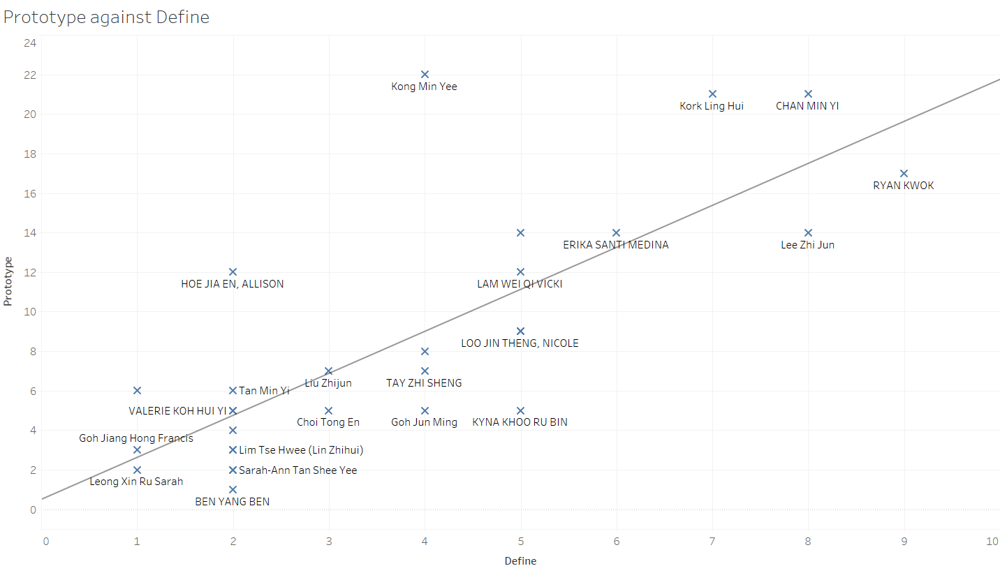
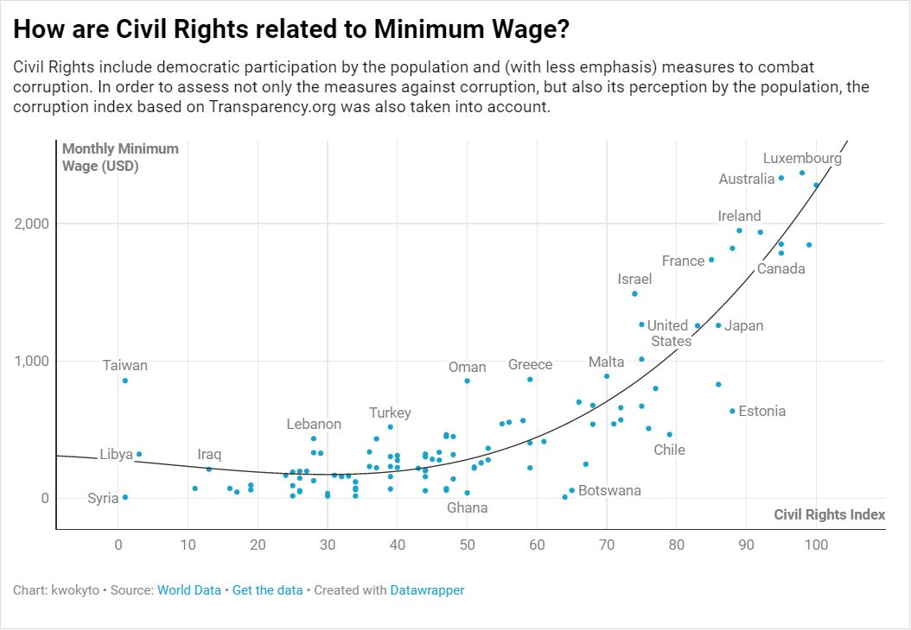

# Collection of All Work

[Developing Meaningful Indicators](https://www.usp.nus.edu.sg/curriculum/usp-modules/developing-meaningful-indicators/) (DMI) was a module in USP taught be Dr. Charles Burke.
DMI allowed us understand, use, and visualise data in a way that prioritises creating an effect on others.
This is in-line with the [USP](https://www.usp.nus.edu.sg/about/overview/)'s purpose to shape independent, adaptable thinkers and doers who will make an impact in the world.

This page serves as repository of all my work created during this module. Each set of visualisation are presented in chronological order, and iterations within each set can be observed as well.

## Contents

1. [Big 5](#big-5)
2. [Suicides](#suicides)
3. [Movie Ratings](#movie-ratings)
4. [Sentiment Analysis](#sentiment-analysis)
5. [30% Rule](#30%-rule)
6. [Comparing Machine Learning](#comparing-machine-learning)
7. [Human Rights](#human-rights)
8. [Digital Inclusion](#digital-inclusion)
9. [Midterm Results](#midterm-results)
10. [Resale Flats](#resale-flats)
11. [Minimum Wage](#minimum-wage)
12. [Women Ministers](#women-ministers)
13. [Avengers](#avengers)
14. [Shootings](#shootings)
15. [Duolingo](#duolingo)
16. [Netflix Originals](#netflix-originals)
17. [Reorganisation](#reorganisation)

## Big 5

The Big 5 is a personality test that the class took. This set of visualisations attempt to graph the collective results.

## Suicides

This set of charts analysed suicide rates.

## Movie Ratings

Being a huge movie fan, I compared my own ratings of movies I had watched against IMDB and other movie statistics.

## Sentiment Analysis

This was done in collaboration with Ling Hui and does sentiment analysis on Reddit comments.

## 30% Rule

This two gifs were inspired by the rule that states that one should only spend 30% of their salary on rent.

## Comparing Machine Learning

Comparing Amazon Web Service Comprehend and Microsoft Azure Sentiment Analysis, these two graphs were created based on tweets.

## Human Rights

This graph was created to compare human rights score in Singapore and Malaysia.

## Digital Inclusion

Inspired by the Roland Berger study, this set of graphs describes how digitally inclusive Singapore is.

## Midterm Results

Dr. Burke had released our midterm scores and the following set of visualisations attempt to describe that dataset.

## Resale Flats

This was spawned from a conversation I had with my girlfriend about buying a house.

[resale_1](./resale/1.mp4)

## Minimum Wage

This was conducted in collaboration with Erika, who shared a common interest in minimum wage.

## Women Ministers

This set was conducted in collaboration with Rhea, who was interested in women in position of power.

[women_ministers_1](./women_ministers/1.mp4)
[women_ministers_2](./women_ministers/2.mp4)
[women_ministers_3](./women_ministers/3.mp4)

## Avengers

These two videos attempted to develop an indicator of how popular each Avenger was.

[avengers_1](./avengers/1.mp4)
[avengers_2](./avengers/2.mp4)

## Shootings

This set of visualisations explored the use of sunburst and radial charts using a dataset about police shootings in the US, and done in collaboration with Ling Hui.

## Duolingo

This set of charts were reference Duolingo statistics, with the emphasis on the use of chord diagrams.

## Netflix Originals

This was done in collaboration with Valerie, and over our shared love in Netflix.

## Reorganisation

This set of visualisations were done during the informal hackathon conducted during the last week of lessons, and co-created with my partner Kok Lee.

